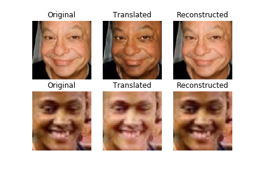
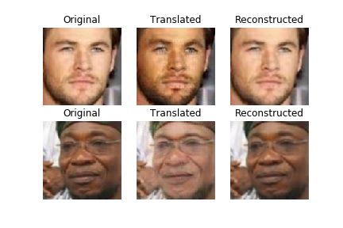
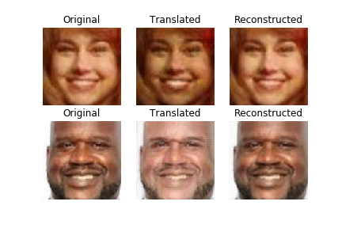
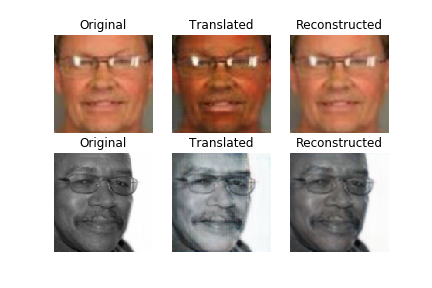
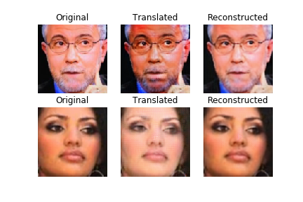

# Eip3-Phase2-Assignment

##### Aim 

To reporduce results similar to https://github.com/sungnam0/Face-Aging-with-CycleGAN and add extra enhancements

Took sample code from https://github.com/eriklindernoren/Keras-GAN/blob/master/cyclegan/cyclegan.py and modified to tune to the requirement of the project

The new enhancement added as part of the project is a **single generator** is trained to do **two-tasks** based on a **conditional input**. 

If a number 0 is passed as part of the input to the network it converts the race of the person from white to black. If number 1 is passed it changes age of person from 20 to 50.

This is achieved by a **single generator** but with **2 discriminators** one for age and one for race

Input number is copied into an array of same shape as image and sent as the **4th channel** of image to the neural network

The network is **trained simulatenously** to change both age and race based on the input provided

#### Examples of output by network

