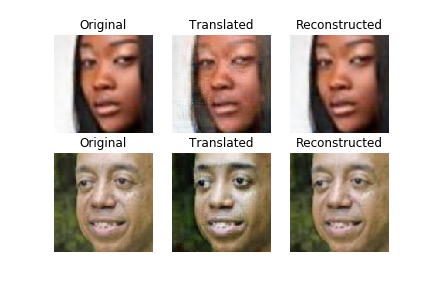
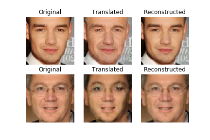
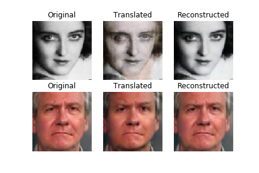
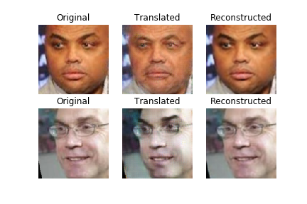
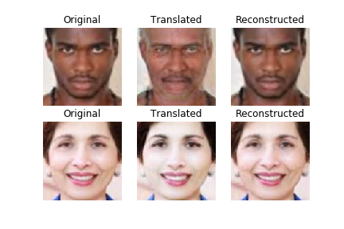
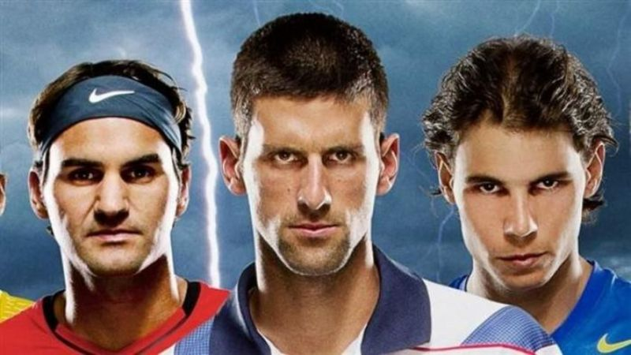
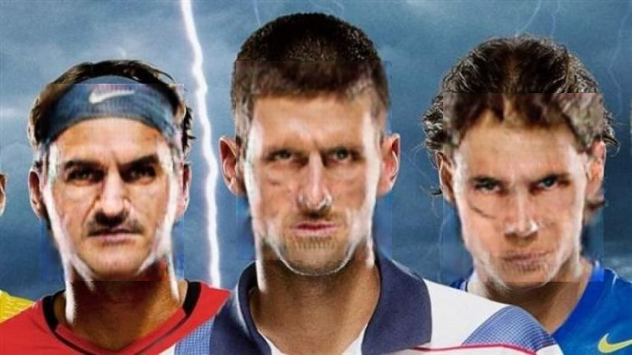
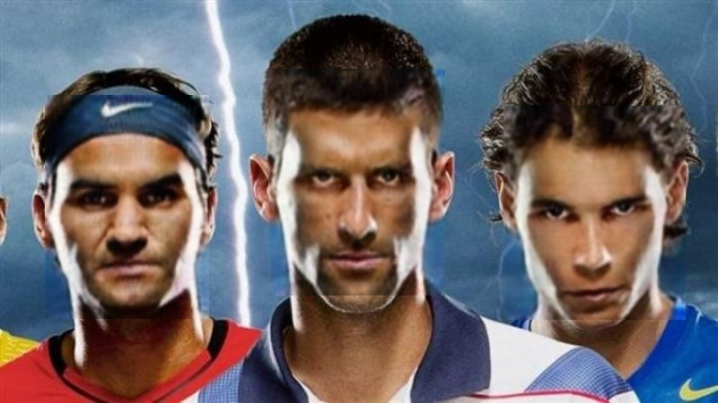

# Eip3-Phase2-Assignment

##### Aim 

To reporduce results similar to https://github.com/sungnam0/Face-Aging-with-CycleGAN and add extra enhancements

Took sample code from https://github.com/eriklindernoren/Keras-GAN/blob/master/cyclegan/cyclegan.py and modified to tune to the requirement of the project

The new enhancement added as part of the project is a **single generator** is trained to do **two-tasks** based on a **conditional input**. 

If a number 0 is passed as part of the input to the network it converts the race of the person from white to black. If number 1 is passed it changes age of person from 20 to 50.

This is achieved by a **single generator** but with **2 discriminators** one for age and one for race

Input number is copied into an array of same shape as image and sent as the **4th channel** of image to the neural network

The network is **trained simulatenously** to change both age and race based on the input provided

#### Examples of output by network

#### When passing race input

#### When passing age input

### Additional enhancement
Apply the model on a group pic
**Detect** all the faces in the image using opencv face detector get the crops pass through the gan, get the modified images and put it back in the same location where it is cropped from

### Original

### Coverted to old with passing 0 as input

### Converted to black passing 1 as input

#### Things tried out
1. Modified keras-gan code to change generator architecture from U-Net to Resnet and made few other small changes such as changing the number of input channels to match with the code provided by Rohan
2. Played a lot with weights to the loss so that the network behaves properly. One key identification is cyclic loss dominates adversial loss due to which network tries to re-create same image more. To deal with it cyclic loss weight is reduced until the losses are comparable.
3. Since the generator does multiple tasks had to train generator with care since it picks up one task fast and then can't pick up another task. In my case it could easily convert race within few epochs but was struggling with age conversion. So tried things like training gan more on age task or completely on age task
4. Progressive training is a must to quickly check any change made, otherwise it takes a lot of time to find out the behaviour. Tried out with different sizes such as 32x32, 48x48, 64x64, 96x96, 128x128, 192x192 and 256x256. 64x64 allows a batch size of 32 on colab which is ideal for checking tweaks. With lower sizes such as 32x32 the output of discriminant size becomes too small and the gradient will not be enough for generator to train so not preferred.
5. Added code to save model weights otherwise need to re-train everytime.
# Achievements

Trained a **single generator** to do multiple tasks based on the input instead of training 2 generators which is the general case.
